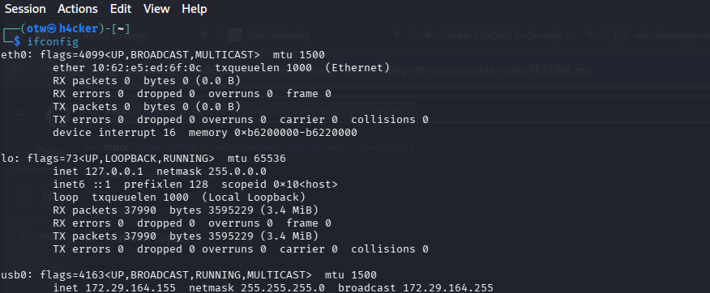
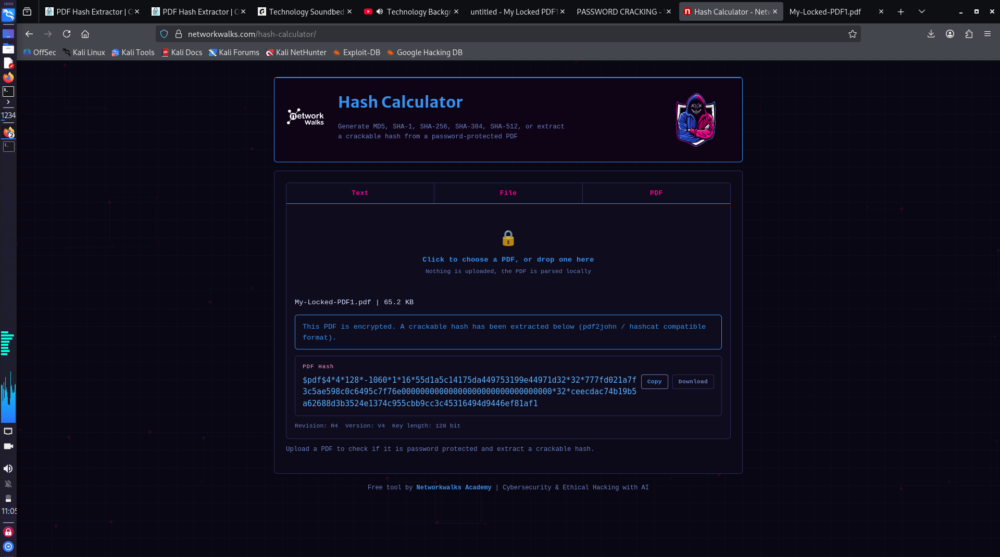
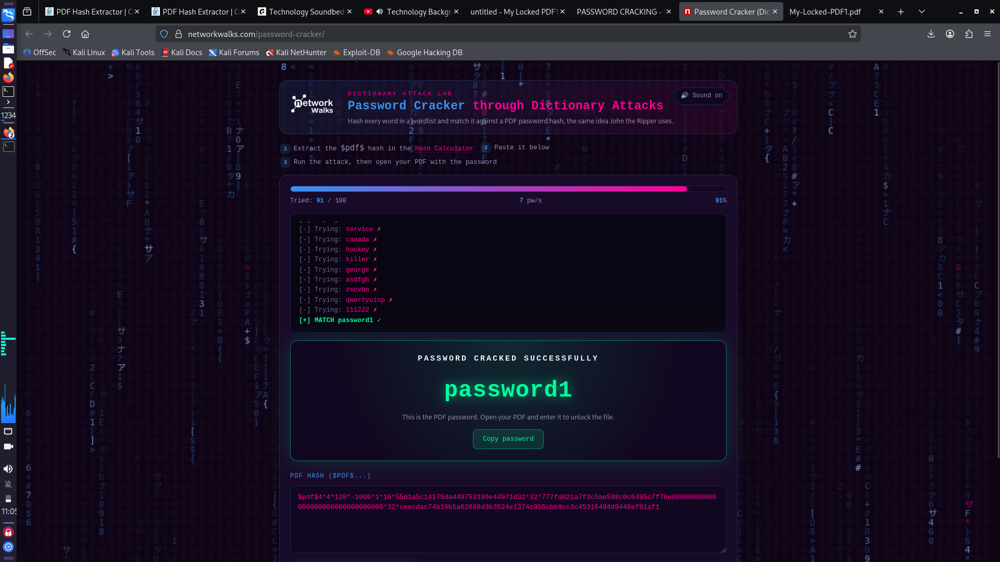
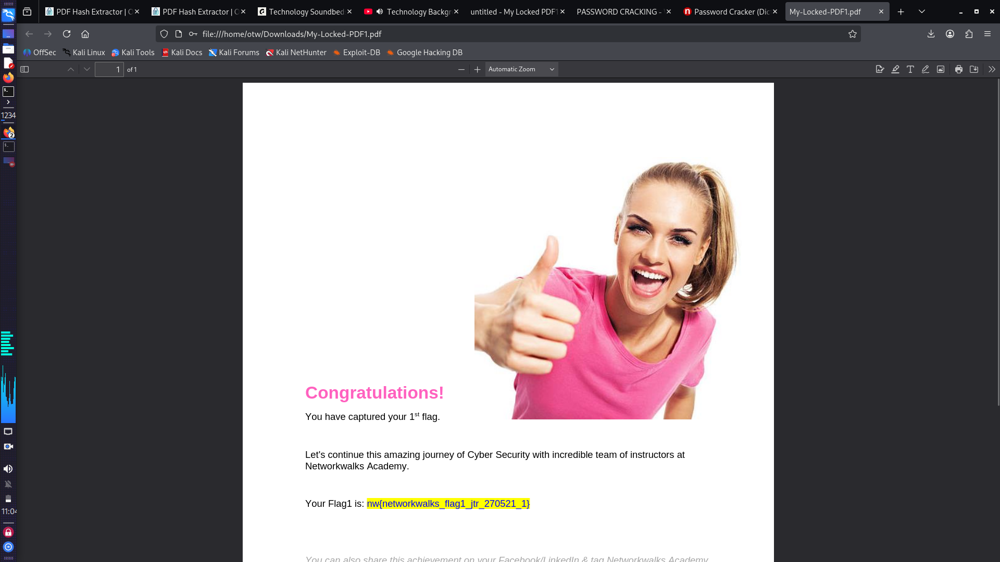
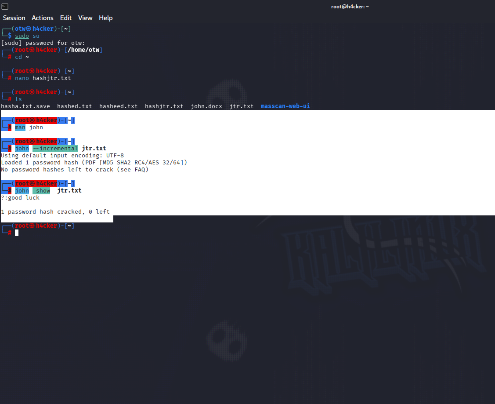

# 🔓 NetworkWalks Lab: Cracking Encrypted PDFs & CLI Cryptanalysis

> **Lab Status:** Completed & Flags Captured  
> **Target:** PDF Encryption Bypass & Offline Hash Cracking  
> **Author:** Brian Machayo

---

## ⚡ The Rundown

Secured PDFs don't stop attacks if an adversary can pull the file off the disk. The access lock is just client-side enforcement—the actual cryptographic authentication data lives directly inside the PDF header. 

In this lab, I bypassed standard viewer controls by dumping the PDF security handler hashes and taking the fight offline. Two targets, two distinct attack vectors: automated dictionary matching and CLI brute-force using **John the Ripper (JtR)** on Kali Linux.

---

## 🧰 Attack Arsenal

* **System:** Kali Linux (Dual-boot / CLI)
* **Engines:** John the Ripper (`jtr`), Online PDF Hash Extractor & Dictionary Harness
* **Network Stack:** `iproute2` (`ip a`, `ifconfig`)
* **Format Under Test:** PDF V4 / R4 (128-bit encryption)

---

## 🛠️ Execution & Proof of Work

### Phase 1: Network & Terminal Setup

Before hitting the targets, I verified the local stack, network interfaces, and IP addressing across `eth0` and `wlan0`. Clean environment, zero noise.

<p align="center">
  
</p>

* Audited active interface configuration (`10.50.0.239/16` on `eth0`) to guarantee stable communication with the lab environment.

---

### Phase 2: Ripping the Hash from `My-Locked-PDF1.pdf`

I extracted the cryptographic hash from `My-Locked-PDF1.pdf` (65.2 KB) into `pdf2john` / `hashcat` format[cite: 4].

<p align="center">
  
</p>

* **Specs:** Revision 4, Version 4, 128-bit key[cite: 4]
* **Target Hash Extracted:**
  ```text
  $pdf$4*4*128*-1060*1*16*55d1a5c14175da449753199e44971d32*32*777fd021a7f3c5ae598c0c6495c7f76e00000000000000000000000000000000*32*ceecdac74b19b5a62688d3b3524e1374c95cbb9cc3c45316494d9446ef81af1
  ```[cite: 4]

---

### Phase 3: Vector 1 — Dictionary Attack & Flag 1

Pushed the extracted hash directly against a wordlist engine[cite: 3].

<p align="center">
  
</p>

* **Hit:** Matched on candidate `91 / 100`[cite: 3].
* **Recovered Credential:** `password1`[cite: 3]

Fed the cracked password straight into the secured file to unlock the document and pull Flag 1[cite: 2, 3]:

<p align="center">
  
</p>

* **Flag 1:** `nw{networkwalks_flag1_jtr_270521_1}`[cite: 2]

---

### Phase 4: Vector 2 — Terminal Cracking via John the Ripper

For the second challenge, no web wrappers. Strictly terminal, strictly John the Ripper inside Kali Linux.

1. **Staged the Hash:**
   Dropped into root and dumped the second target hash into `jtr.txt`:
   ```bash
   sudo su
   cd ~
   nano jtr.txt
   ls
   ```[cite: 5]

2. **Fired Incremental Mode:**
   Ran JtR in `--incremental` mode to iterate through permutations rather than relying on a static wordlist[cite: 5]:
   ```bash
   john --incremental jtr.txt
   ```[cite: 5]

3. **Hash Cracked:**
   Checked the cracked store via `john --show jtr.txt`[cite: 5]:
   ```text
   Loaded 1 password hash (PDF [MD5 SHA2 RC4/AES 32/64])
   ?:good-luck
   1 password hash cracked, 0 left
   ```[cite: 5]

<p align="center">
  
</p>

* **Recovered Credential:** `good-luck`[cite: 5]

---

### Phase 5: Unlocking Target 2 & Flag 2

Used `good-luck` on the Desktop PDF  to strip the encryption and dump the payload[cite: 5, 6]:

<p align="center">
  
</p>

* **Flag 2:** `nw{cybersecurity_flag_captured_2608}`[cite: 6]

---

## 🧠 Defensive Takeaway

1. **Weak Entropy Kills:** Passwords like `password1` and `good-luck` get shredded in milliseconds against offline wordlists or raw incremental passes[cite: 3, 5].
2. **Offline Exposure:** PDF headers expose the security handler hash to whoever holds the file[cite: 4]. If you don't use dynamic identity tokens (IRM) or robust 256-bit AES with hardened KDFs, the file is as good as plaintext once it leaves your network.

---

**Built by Brian Machayo **
*cybersecurity analyst & Network engineer*
